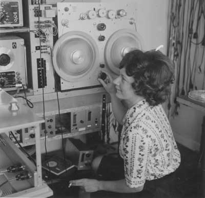

# Digital Signal Processing talk
CascadiaJS 2015

* [resources](./resources.md) for learning more about digital signal processing
* [web-audio-modules](https://github.com/meandavejustice/web-audio-modules)
* [audio-graph-editor](https://github.com/meandavejustice/audio-graph-editor)

## Credits
Demo audio is from _Faust & mefisto_ by Else Marie Pade you can find a
full version [here](https://www.youtube.com/watch?v=28TqFKy4lG0).

